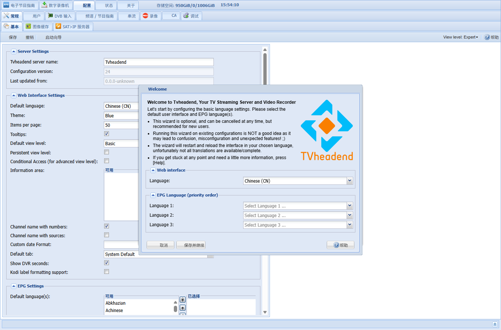

<div align="center">

[](https://github.com/tvheadend/tvheadend/actions/workflows/build-cloudsmith.yml)
[](https://scan.coverity.com/projects/2114)
[](https://github.com/tvheadend/tvheadend)

[](https://github.com/tvheadend/tvheadend/releases)
[](./LICENSE.md) 
[](https://github.com/tvheadend/tvheadend/commits)

[](https://cloudsmith.io/~tvheadend/repos/tvheadend/packages/)

</div>

Tvheadend
=========

Tvheadend is the leading TV streaming server and Digital Video Recorder for Linux.


Simplified Chinese / 简体中文汉化版
----------------------------------

这个 fork 在上游 Tvheadend 的基础上补充了简体中文 Web UI 翻译，并修复了
常见反向代理场景下的 `X-Forwarded-For` 解析兼容问题，同时改善了
M3U 播放列表对 IPTV 客户端分组和台标字段的兼容性。

已更新的翻译文件：

  * `intl/tvheadend.zh-Hans.po`
  * `intl/tvheadend.zh.po`
  * `intl/js/tvheadend.js.zh-Hans.po`
  * `intl/js/tvheadend.js.zh.po`
  * `intl/docs/tvheadend.doc.zh-Hans.po`

使用时在 Web 界面语言中选择 `Chinese (CN)`。Tvheadend 会将该选项映射到
`zh-Hans` 简体中文语言包。

汉化覆盖范围：

  * 主导航、配置页签、频道 / 节目指南、录像、用户、调试等常用 Web UI 文案
  * `配置 -> 基本` 中常见后端字段，例如服务器名称、频道图标命名方案、
    PROXY 协议和 X-Forwarded-For、RTSP UDP 端口、更新时间容差等
  * 播放列表、状态页、调试页中的常见按钮和提示，例如流过滤器、已删除录像、
    显示密码、选择子系统、应用运行时配置等

说明：Tvheadend 的部分字段来自后端 idnode 翻译表，需要随镜像重新编译后才会
生效；浏览器刷新或替换前端 JS 语言包不能单独更新这类字段。

Lucky / 反代兼容修复：

  * 修复开启 `PROXY protocol & X-Forwarded-For` 后，常见反代发送
    `X-Forwarded-For: 1.2.3.4, 5.6.7.8` 被判为错误请求的问题
  * 兼容部分反代发送的 IPv4 带端口格式，例如
    `X-Forwarded-For: 1.2.3.4:12345`
  * 保留 IPv6 地址处理逻辑，避免把 IPv6 中的冒号误认为端口分隔符

播放列表兼容改进：

  * M3U 播放列表 `#EXTM3U` 头部自动输出 `x-tvg-url`，指向同域名的
    `/xmltv/channels` 并携带相同的认证参数，IPTV 客户端加载播放列表后可自动
    获取 EPG 节目指南，无需手动配置 EPG 地址
  * `/playlist/auth/channels.m3u` 会为频道输出 `group-title`，分组来自频道绑定的
    第一个已启用、非内部频道标签，便于 mytv、IPTV 播放器等客户端按标签分组
  * `/playlist/auth/grouped.m3u` 作为频道列表别名可直接使用，同样包含 `group-title`
    和频道元数据
  * M3U 条目补充 `tvg-name`、`tvg-id`、`tvg-chno`，方便客户端识别频道名、频道号和
    EPG 关联
  * `tvg-logo` 优先使用 Tvheadend 的 `/imagecache/` 可访问地址；未缓存的本地
    `file://` 台标路径不会暴露到播放列表，避免外部客户端拿到不可访问的本机路径
  * 浏览器需要强制下载播放列表时，可以追加 `download=1`，例如
    `/playlist/auth/channels.m3u?download=1`
  * 播放列表字段会规整换行和制表符，减少异常频道名、标签名或录像标题导致的
    M3U/E2/SATIP 播放列表格式问题



It supports the following inputs:

  * ATSC
  * DVB-C(2)
  * DVB-S(2)
  * DVB-T(2)
  * HDHomeRun
  * IPTV
    * UDP
    * HTTP
  * SAT>IP
  * Unix Pipe

It supports the following outputs:

  * HTSP (native protocol)
  * HTTP
  * SAT>IP

Documentation
-------------

Tvheadend documentation can be found here: [https://docs.tvheadend.org](https://docs.tvheadend.org).

Support
-------

Please triage issues and ask questions in the forum: [https://tvheadend.org](https://tvheadend.org) or use the `#hts` IRC channel on Libera.Chat to speak with project staff: [https://web.libera.chat/#hts](https://web.libera.chat/#hts).

Please report triaged bugs via GitHub Issues. 

Building for Linux
------------------

First you need to configure:

	$ ./configure

If build dependencies are missing the configure script will complain or attempt
to disable optional features.

To build the binary:

	$ make

After compiling the Tvheadend binary is in the `build.linux` directory.

To run the Tvheadend binary:

	$ ./build.linux/tvheadend

Settings are stored in `$HOME/.hts/tvheadend`.

To install the newly compiled Tvheadend binary and associated files onto your system:

	$ sudo make install

Running on Linux
----------------

Instructions for popular distributions are in our public [documentation](https://docs.tvheadend.org/documentation/installation/linux).

Running in Docker
-----------------

Running in Docker can be as simple as:

	$ docker run --rm ghcr.io/tvheadend/tvheadend:latest

使用这个简体中文 fork 的镜像：

	$ docker pull ghcr.io/qqcomeup/tvheadend:latest
	$ docker run --rm -p 9981:9981 -p 9982:9982 ghcr.io/qqcomeup/tvheadend:latest --firstrun

该镜像包含本 fork 的简体中文翻译、Lucky / `X-Forwarded-For` 兼容修复和
M3U 播放列表分组改进。升级已有 Docker Compose 部署时，通常只需要拉取新镜像并
重建容器，配置目录保持不变。

推荐 Docker Compose 部署：

```yaml
services:
  tvheadend:
    image: ghcr.io/qqcomeup/tvheadend:latest
    container_name: tvheadend
    restart: unless-stopped
    environment:
      - TZ=Asia/Shanghai
    ports:
      - "9981:9981"
      - "9982:9982"
    volumes:
      - ./config:/var/lib/tvheadend:rw
      - ./recordings:/var/lib/tvheadend/recordings:rw
      # 可选：本地台标目录，对应 file:///picons/%C.png
      - ./picons:/picons:ro
    devices:
      # 可选：DVB 设备
      - /dev/dvb:/dev/dvb
      # 可选：硬件转码 / VAAPI / QSV
      - /dev/dri:/dev/dri
```

使用 Lucky 或其他反代时，直接反代到 `http://服务器IP:9981` 即可，不需要额外
nginx real-IP 中转容器。播放列表强制浏览器下载可追加 `download=1`，例如
`/playlist/auth/channels.m3u?download=1`。

See [README.Docker.md](README.Docker.md) for more details.
